<div align="center">


<a href="https://github.com/saifalaswad43/Electricity-ML">
  
</a>

<br/>


<br/><br/>

<a href="https://electricity-ml-5zhdpjyvagfwxxzsknhxjv.streamlit.app/">
  
</a>

<br/><br/>


</div>

<br/>

<div align="center">

</div>

## ⚡ Overview

🔗 **Live demo:** [electricity-ml-5zhdpjyvagfwxxzsknhxjv.streamlit.app](https://electricity-ml-5zhdpjyvagfwxxzsknhxjv.streamlit.app/)

**Electricity Consumption AI** is a Streamlit web app that predicts your **monthly electricity consumption (kWh)** for any device, room, or usage pattern — combining a trained **Machine Learning model** with a transparent **physics-based formula**, side by side. Model artifacts are pulled live from the **Hugging Face Hub**, so the app always runs the latest trained pipeline without shipping heavy files in the repo. It comes packed with cost estimation, CO₂ impact tracking, saving recommendations, and rich interactive analytics — now with a redesigned, animated interface.

<div align="center">

</div>

---

## 🆕 What's new in this update

- **Redesigned UI** — animated gradient hero header, glowing tier badges, and hover-responsive metric cards for a more professional feel.
- **Smoother motion** — fade-in transitions on results, a pulsing usage-tier badge, and shimmering background gradients instead of static panels.
- **Reproducibility fix** — the training notebook previously hard-coded a local Windows path (`D:\saifproject\...`) to load `electricity_dataset.csv`; it now uses a relative path so the notebook runs for anyone who clones the repo.
- **Pipeline parity** — the app's inference code now mirrors the notebook's exact `apply_basic_cleaning → impute → encode → scale → select → predict` order, so predictions match the notebook's own end-to-end test.

---

## ✨ Features

<table>
<tr>
<td width="50%" valign="top">

### 🏠 Predict
- Full device / room / usage input form
- Live **ML prediction** vs **formula estimate**
- Physical plausibility check (catches impossible predictions)
- Animated gradient metric cards

</td>
<td width="50%" valign="top">

### 📊 Analysis
- Consumption distribution across the dataset (Plotly)
- Session tier-distribution donut chart
- Device-level breakdown & averages
- Dark-themed, animated charts

</td>
</tr>
<tr>
<td width="50%" valign="top">

### 📜 History
- Session-based prediction log
- Filter by tier & plausibility
- Sort by date or predicted usage
- One-click history reset

</td>
<td width="50%" valign="top">

### 🌍 Insights
- 💰 Monthly bill estimation
- 🌳 CO₂ emissions & trees-needed equivalent
- 💡 Personalized energy-saving tips by tier
- 🏷️ Low / Medium / High / Very High usage badges with animated glow

</td>
</tr>
</table>

---

## 🧠 How It Works

```mermaid
flowchart LR
    A[User Input<br/>device · room · watts · hours] --> B[Data Cleaning<br/>& Validation]
    B --> C[Imputation<br/>Numeric · Categorical]
    C --> D[Encoding<br/>OneHot · Month · Usage Level]
    D --> E[Robust Scaling]
    E --> F[Feature Selection]
    F --> G["🤗 Model from Hugging Face Hub"]
    G --> H[Monthly kWh Prediction]
    H --> I[🧮 Compared vs Formula Estimate]
    I --> J[💰 Cost · 🌍 CO₂ · 💡 Tips]
```



The app cross-checks every ML prediction against a **physics-based sanity formula** (`watts × hours × quantity × days ÷ 1000`) and flags results that fall outside a physically plausible range — so you never get a silently broken prediction.

**Consumption tiers:** `Low` → `Medium` → `High` → `Very High`, each with tailored saving tips and a color-coded, glowing badge.

---

## 🚀 Getting Started

### 1️⃣ Clone the repository
```bash
git clone https://github.com/saifalaswad43/Electricity-ML.git
cd Electricity-ML
```

### 2️⃣ Install dependencies
```bash
pip install -r requirements.txt
```

### 3️⃣ Run the app
```bash
streamlit run app.py
```

The app will open automatically at `http://localhost:8501` ⚡ — model artifacts are downloaded automatically from Hugging Face on first launch.

---

## 📂 Project Structure

```
Electricity-ML/
├── app.py                       # Streamlit application (predict · analysis · history · about)
├── electricity_notebook.ipynb   # EDA, preprocessing & model training notebook
├── electricity_dataset.csv      # Household electricity consumption dataset
└── requirements.txt             # Dependencies
```

> 🤗 Trained model & preprocessing artifacts (encoders, scaler, imputers, selected features) are hosted separately on the **Hugging Face Hub** at `saifalaswad/electricity-consumption-model` and downloaded on demand — keeping this repo lightweight.

---

## 🛠️ Tech Stack

<div align="center">


</div>

---

## 📊 Dataset & Inputs

The model is trained on household electricity usage records capturing device-level behavior. Key input fields:

| Field | Description |
|:--|:--|
| `month` / `season` | Time-of-year context |
| `room_name` | Bedroom, Kitchen, Living Room, Bathroom, etc. |
| `device_name` | Light, Fan, TV, AC, Fridge, Heater, Washing Machine, etc. |
| `watts` · `hours` · `quantity` | Device power, daily runtime, and count |
| `cost_per_kwh` | Local electricity tariff |
| `usage_level` | Low / Medium / High |
| `is_heavy_appliance` | Flags high-draw devices |

**Target:** Predicted monthly consumption in **kWh**.

---

## 🤝 Contributing

Contributions, issues, and feature requests are welcome!

1. Fork the project
2. Create your feature branch (`git checkout -b feature/amazing-feature`)
3. Commit your changes (`git commit -m 'Add amazing feature'`)
4. Push to the branch (`git push origin feature/amazing-feature`)
5. Open a Pull Request

---

## 📄 License

This project is licensed under the **MIT License**.

---

<div align="center">

### ⭐ If you found this project useful, consider giving it a star!


</div>
